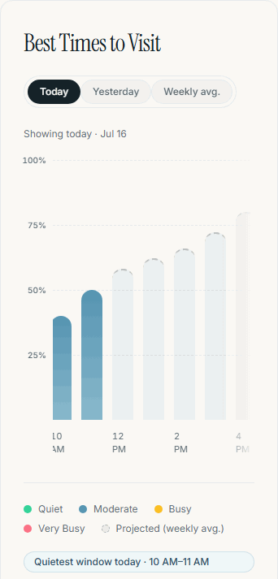
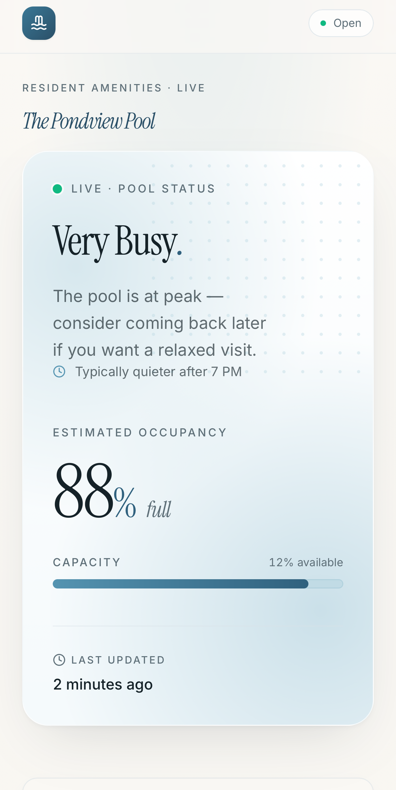
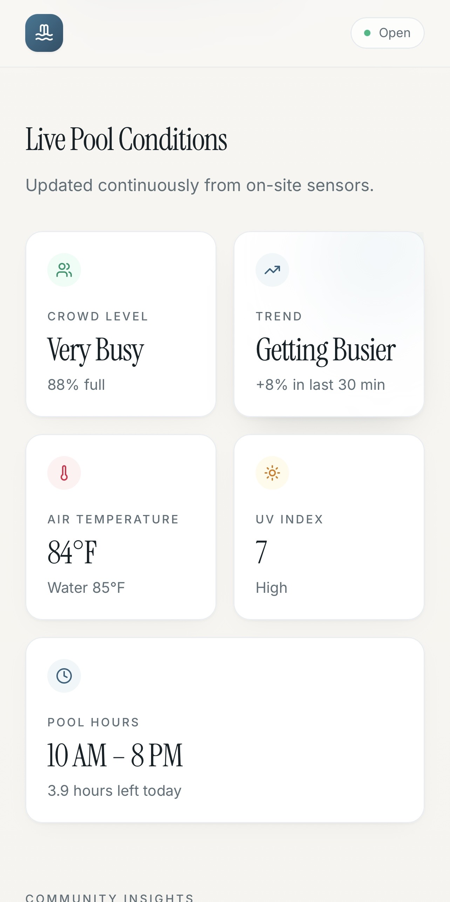

# Pondview Pool Status

A live, resident-facing dashboard for the community pool at Pondview Estates (Wharton, NJ). Residents can check how busy the pool is right now, find the best times to visit, and see current conditions — before walking over with a towel.

Built with Next.js 15 (App Router), React 19, TypeScript, and Tailwind CSS.

## What residents see


## Tour

<div align="center">
  
</div>

### 📊 Best Times to Visit

An hourly activity chart with **Today / Yesterday / Weekly avg.** tabs. Confirmed hours render as colored bars; future hours show as dashed **ghost bars projected from the weekly average**, and a pill calls out the quietest window so far today.

<div align="center">
  
</div>

On mobile the chart becomes a horizontally scrollable track — with edge fades, a scroll-progress indicator, and a one-time sweep so residents notice there's more day to see:

<div align="center">
  
</div>

### 📱 Designed mobile-first

Residents check on their phones on the way out the door — every section is built for a narrow screen first.

<div align="center">
  
  &nbsp;&nbsp;
  
  &nbsp;&nbsp;
  
</div>

The site is schedule-aware (shows Closed outside pool hours) and every section degrades gracefully to "not enough data yet" states when readings are missing.

## Data pipeline

```
Camera / CV process ┄┄POST /api/sensor-reading┄┄▶ ┐  (planned — not yet connected)
Admin data editor ──────────────────────────────▶ Postgres (occupancy_readings)
                                                        │
Open-Meteo (weather, no key) ──┐                        │ aggregates
Upstash Redis (admin override) ─┼──▶ GET /api/pool-data ─┴──▶ dashboard (polls)
```

> **Current status:** the on-site camera isn't connected yet. Occupancy readings are being entered by hand in the [data editor](#admin-panel) (`/admin/data`) while camera access is pending. Everything downstream already runs on that data — swapping in the camera is just a matter of it POSTing to `/api/sensor-reading`; no other changes are needed.

- **Occupancy readings** live in Postgres and drive every aggregate (hourly curves, weekly stats, trend). They're currently entered manually via the data editor; the `/api/sensor-reading` endpoint is built and ready for the camera to POST to once it's online.
- **Weather** (air temp, UV) comes from Open-Meteo — no API key, cached ~10 min.
- **Admin override** (force-close with a reason) lives in Upstash Redis and takes precedence over the schedule.
- The schema is bootstrapped automatically on first use — no migration step.

## Usage

```bash
npm install
npm run dev
```

The app runs without any configuration — you'll just see the empty "awaiting data" states. To light everything up, create `.env.local`:

| Variable | Purpose |
| --- | --- |
| `DATABASE_URL` | Postgres connection string (Neon, Supabase, Railway, …). Powers occupancy history and all aggregates. |
| `UPSTASH_REDIS_REST_URL` / `UPSTASH_REDIS_REST_TOKEN` | Stores the admin open/closed override. |
| `ADMIN_PASSWORD` | Password for the admin panel at `/admin/login`. |
| `SENSOR_API_KEY` | Bearer token the camera must send to `POST /api/sensor-reading`. |

In development, missing vars are tolerated (queries return empty, admin/sensor auth is skipped or fails closed). In production, `DATABASE_URL` is required.

### Seed demo data

With `DATABASE_URL` set, generate a week of plausible readings so the charts have something to show:

```bash
node scripts/seed-readings.mjs           # last 7 days
node scripts/seed-readings.mjs --days 14 # more history
node scripts/seed-readings.mjs --reset   # truncate first
```

## API routes

| Route | Method | Purpose |
| --- | --- | --- |
| `/api/pool-data` | GET | Full dashboard snapshot: status, conditions, hourly activity, weekly usage. Polled by the client. |
| `/api/pool-status` | GET | Admin open/closed override state. |
| `/api/sensor-reading` | POST | Ingest an occupancy reading. `Authorization: Bearer <SENSOR_API_KEY>`, body `{ "occupancy": 17, "recordedAt"?: ISO }`. Built for the camera — ready but not yet in use. |
| `/api/admin-auth` | POST | Admin login (sets an auth cookie). |
| `/api/admin-readings` | GET / POST / PATCH / DELETE | Admin CRUD over raw occupancy readings (powers the data editor). Requires an admin session. |
| `/api/demo-mode` | GET / POST | Toggle demo mode: the resident view serves generated example data instead of database readings. Requires an admin session. |

## Admin panel

`/admin/login` gates the admin area (auth via an HMAC-signed cookie derived from `ADMIN_PASSWORD`).

- **`/admin/pool`** — force-close the pool with a resident-facing reason (e.g. maintenance, weather). The override takes effect on residents' screens within a few seconds and always wins over the schedule.
- **`/admin/data`** — a spreadsheet-style editor for the raw `occupancy_readings` table. **This is currently the primary way readings get in**, since the camera isn't connected yet. View, search, edit, delete, and insert readings in a scrolling window; the dashboard's charts and stats recompute from this table. Requires `DATABASE_URL`. Also hosts the **demo mode** toggle, which serves generated example data to the resident view (nothing written to the database) — useful for demos or when no database is connected.

## Configuration

Pool facts live in [lib/config.ts](lib/config.ts): capacity, timezone, coordinates (used for weather), open hours (10 AM–8 PM), sensor cadence, and freshness/trend windows. Change the pool's location or hours there — everything else derives from it.

All time math is done in the pool's local timezone (`America/New_York`) via [lib/time.ts](lib/time.ts), regardless of where the server or visitor is.

## Project structure

```
app/
  page.tsx              # resident dashboard
  admin/                # login + pool controls
  api/                  # pool-data, pool-status, sensor-reading, admin-auth
components/             # hero-status, best-times-chart, live-conditions, weekly-usage, …
hooks/                  # client polling + scroll restoration
lib/                    # config, db, aggregates, weather, auth, effective status
scripts/seed-readings.mjs
```

## Deployment

Deploys as a standard Next.js app (built for Vercel — includes Speed Insights). Set the four environment variables above; the `occupancy_readings` table and index are created automatically on first request.
